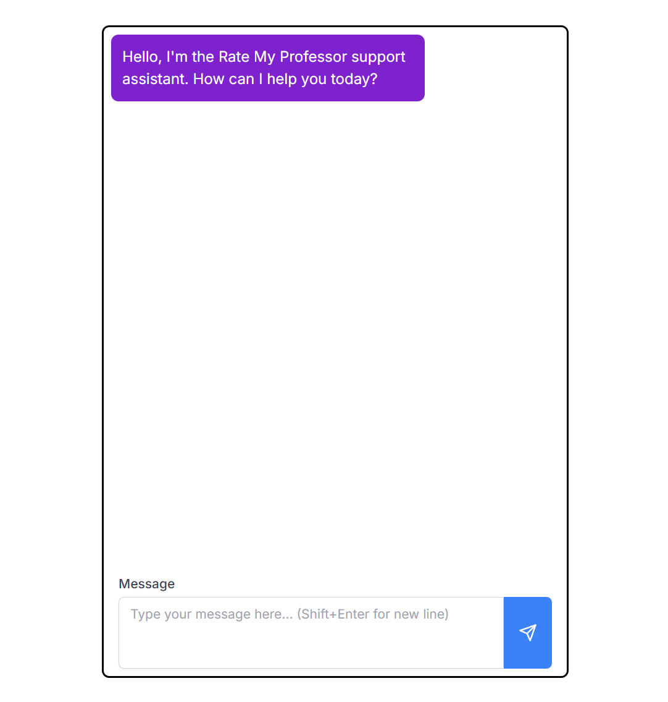

# Rag Project

[](LICENSE)



## Table Of Contents
- [Description](#description)
- [Installation](#installation)
- [Getting Started](#getting-started)
- [Running Tests](#running-tests)
- [Contributing](#contributing)
- [License](#license)


## Description

This is an ai powered chatbot for Rate my Professor or a similar project.

The aim is to have an integrated chatbot that can help sift through a large
amount of reviews through a vector database and provide recommendations, answer
questions, or summarize the content of the reviews in the form of a text chat with the user.

## Installation

1. Clone the repository:
    ```bash
    git clone https://github.com/kjunghoan/rag.git

    cd rag
    ```
2. Create a virtual environment:
    ```bash
    conda create --name <example-venv> python=3.10.14
    ```
3. Activate your venv:
    ```bash
    conda activate <example-venv>
    ```

4. Install dependencies
    ```bash
    npm install && pip -r ./requirements.txt
    ```

5. Create a `.env.local` file in the root directory and add the following environment variables
    ```bash
    cp .env.local.example .env.local
    vim .env.local
    ```

## Getting Started
1. Create API keys:
    - [OpenAi](https://platform.openai.com/assistants)
    - [Pinecone](https://www.pinecone.io/)

2. Load your innitial data as a json file:
    - refer to [the example file](reviews.json.example) for the format
3. Run each snippet in the [load](load.ipynb) file:
    - Verify that everything was loaded correctly using the pinecone dashboard
4. Run a local test on the development server by:
    - Starting the development server:
        ```bash
        npm run dev
        ```
    - Opening the client in a webbrowser:
    [http://localhost:3000](http://localhost:3000)

## Running Tests

To run tests, run the following command

```bash
  npm run test
```

## Contributing

Contributions are always welcome!

See [contributing.md](./contributing.md) for ways to get started.

## License

This project is licensed under the MIT License -
see the [LICENSE](LICENSE) file for details.
